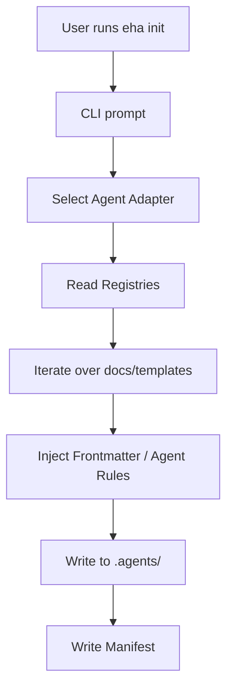
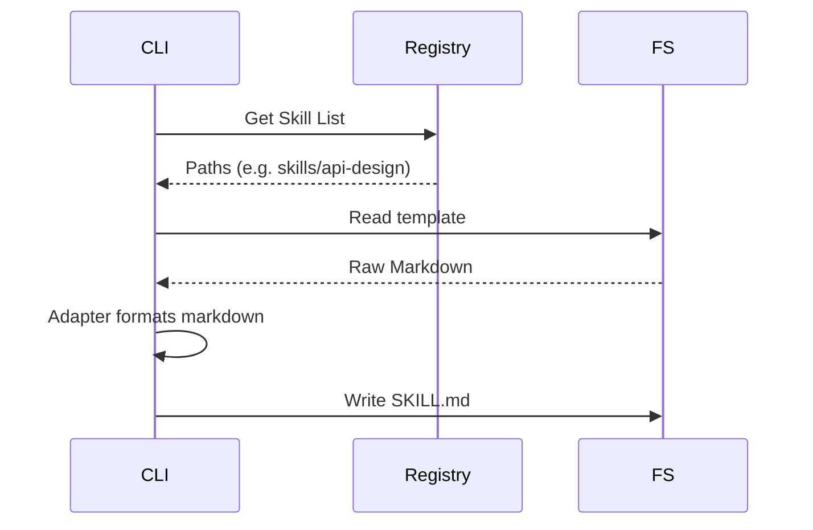

# Architecture

Last update: 2026-05-30

Status: Live

---

## 1. Description
This document outlines the system architecture of the Eye Hate Agent (EHA) CLI tool, detailing the template registry, runtime adapters, and agent rule injection.

## 2. Important
EHA has recently completed a migration to `v1.0.3` which refactored skills into individual folders (`skills/*/SKILL.md`).

## 3. Table of Contents
1. Tech Stack Overview
2. Architecture Pattern
3. System Flow
4. Data Flow
5. Tools Integration
6. Global Parameters and Constraints
7. Architecture Decision Records (ADRs)

## 4. Scope
Covers the Node.js CLI script (`bin/eha.js`), the engine modules (`src/engine`), and the template assets (`docs/templates/`).

## 5. Goals
Detail how `eha init` resolves templates dynamically so future agents can parse them.

## 6. Non Goals
Does not cover specific AI prompt tuning techniques.

## 7. Tech Stack Overview
| Area | Choice | Notes |
| --- | --- | --- |
| Application or service | Node.js (CLI) | Standalone script via `bin/eha.js` |
| Runtime or platform | Local OS | Requires Node 18+ |
| Storage | Local FS | `.eha/manifest.json` |
| External integrations | None | Operates entirely locally |

## 8. Architecture Pattern
EHA uses a **Pipeline and Adapter Pattern**:
- **Registries:** Hardcoded maps of available skills and workflows.
- **Adapters:** Agent-specific formatters (Claude, Copilot, Antigravity) that mutate the raw template before saving it to `.agents/`.

## 9. System Flow

## 10. Data Flow

## 11. Tools Integration
| Integration | Purpose | Kind | Notes |
| --- | --- | --- | --- |
| GitHub Actions | Automated Publishing | Software | Uses OIDC Provenance for NPM |

## 12. Global Parameters and Constraints
- EHA must be completely stateless. It relies solely on reading its bundled templates and checking `.eha/manifest.json` for staleness.

## 13. Architecture Decision Records (ADRs)
- **ADR 1 (v1.0.0):** Shifted from monolithic markdown dumps to individual `SKILL.md` files in nested directories to support strict domain taxonomy.
- **ADR 2 (v1.0.3):** Replaced Gemini with Antigravity natively.

## 14. Success Metrics
- Seamless integration of new agent adapters without refactoring the core logic loop.

## 15. Related Documents
- [Feature Inventory](feature-inventory.md)
- [PRD](prd.md)

## 16. Open Questions
None.
