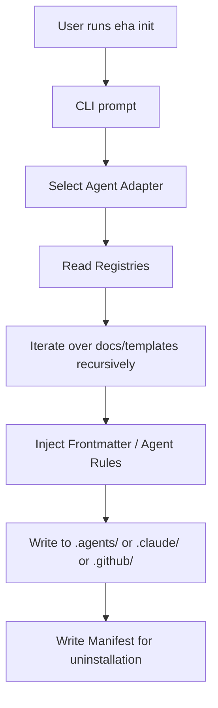
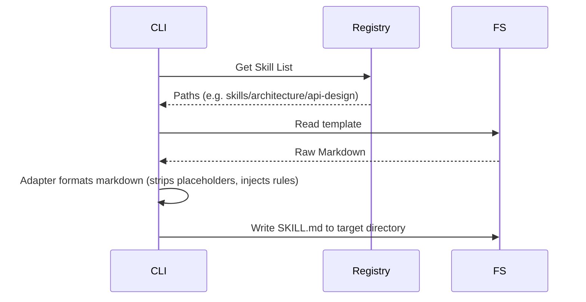

# Architecture

Last update: 2026-05-30

Status: Live

---

## 1. Description
This document outlines the system architecture of the Eye Hate Agent (EHA) CLI tool, detailing the template registry, runtime adapters, and agent rule injection.

## 2. Important
EHA has recently completed a migration to `v1.0.3` which refactored skills into individual folders (`skills/*/SKILL.md`) and formalized the 4-layer taxonomy.

## 3. Table of Contents
- [1. Description](#1-description)
- [2. Important](#2-important)
- [3. Table of Contents](#3-table-of-contents)
- [4. Scope](#4-scope)
- [5. Goals](#5-goals)
- [6. Non Goals](#6-non-goals)
- [7. Tech Stack Overview](#7-tech-stack-overview)
- [8. Architecture Pattern](#8-architecture-pattern)
- [9. System Flow](#9-system-flow)
- [10. Data Flow](#10-data-flow)
- [11. Tools Integration](#11-tools-integration)
- [12. Global Parameters and Constraints](#12-global-parameters-and-constraints)
- [13. Architecture Decision Records (ADRs)](#13-architecture-decision-records-adrs)
- [14. Success Metrics](#14-success-metrics)
- [15. Related Documents](#15-related-documents)
- [16. Open Questions](#16-open-questions)

## 4. Scope
Covers the Node.js CLI script (`bin/eha.js`), the engine modules (`src/engine`), and the template assets (`docs/templates/`).

## 5. Goals
Detail how `eha init` resolves templates dynamically so future agents can parse them without hardcoded references to deprecated architectures.

## 6. Non Goals
Does not cover specific AI prompt tuning techniques.

## 7. Tech Stack Overview
| Area | Choice | Notes |
| --- | --- | --- |
| Application or service | Node.js (CLI) | Standalone script via `bin/eha.js` |
| Runtime or platform | Local OS | Requires Node 18+ |
| Storage | Local FS | `.eha/manifest.json` tracks file state |
| External integrations | None | Operates entirely locally without network calls |

## 8. Architecture Pattern
EHA uses a **Pipeline and Adapter Pattern**:
- **Registries:** Hardcoded maps of available skills and workflows (e.g., `src/engine/skill-registry.js`).
- **Adapters:** Agent-specific formatters (Claude, Copilot, Antigravity, Gemini CLI) that mutate the raw template before saving it to the target platform instruction surface (e.g., `.agents/`).

## 9. System Flow

## 10. Data Flow

## 11. Tools Integration
| Integration | Purpose | Kind | Notes |
| --- | --- | --- | --- |
| GitHub Actions | Automated Publishing | Software | Uses OIDC Provenance for NPM on releases |

## 12. Global Parameters and Constraints
- EHA must be completely stateless between executions. It relies solely on reading its bundled templates and checking `.eha/manifest.json` for staleness/version mismatch.

## 13. Architecture Decision Records (ADRs)
- **ADR 1 (v1.0.0):** Shifted from monolithic markdown dumps to individual `SKILL.md` files in nested directories to support strict domain taxonomy.
- **ADR 2 (v1.0.3):** Replaced Gemini with Antigravity natively and fully dropped support for the `.gemini/` path in favor of `.agents/`.

## 14. Success Metrics
- Seamless integration of new agent adapters without refactoring the core logic loop.
- Recursive registry mapping correctly identifies new domains without explicit hardcoding.

## 15. Related Documents
- [Feature Inventory](feature-inventory.md) - Lists all capabilities.
- [PRD](prd.md) - The vision for this architecture.

## 16. Open Questions
None.
