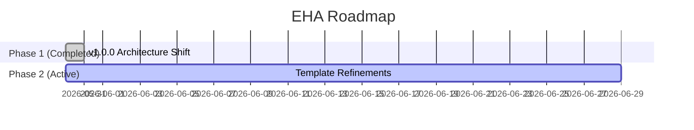

# Phases

Last update: 2026-05-30

Status: Live

---

## 1. Description
This document tracks the roadmap and upcoming epics for the Eye Hate Agent (EHA) project.

## 2. Important
As EHA is a stable meta-tool, new phases are only introduced when adding support for fundamentally new AI IDEs or major architectural shifts in prompt structures.

## 3. Table of Contents
- [1. Description](#1-description)
- [2. Important](#2-important)
- [3. Table of Contents](#3-table-of-contents)
- [4. Scope](#4-scope)
- [5. Goals](#5-goals)
- [6. Non Goals](#6-non-goals)
- [7. Overall Project Timeline](#7-overall-project-timeline)
- [8. Phase Registry](#8-phase-registry)
- [9. Sprint Tracker](#9-sprint-tracker)
- [10. Success Metrics](#10-success-metrics)
- [11. Related Documents](#11-related-documents)
- [12. Open Questions](#12-open-questions)

## 4. Scope
Roadmap planning and epic tracking for the EHA engine and its templates.

## 5. Goals
Provide visibility into what features and fixes are coming next.

## 6. Non Goals
Does not track day-to-day bug fixes or micro-optimizations.

## 7. Overall Project Timeline
EHA has successfully transitioned to the 1.0 architecture (NPM Provenance + Antigravity). Future phases will focus on template parity.

## 8. Phase Registry
- Phase 1: Registry Adapter Architecture (Completed)
- Phase 2: Domain Skills Refactoring (Active)

## 9. Sprint Tracker
### 9.1. Current Sprint (Date Range)
May 2026

### 9.2. Active Tasks
- Migrating local `.agents/rules/` to avoid frontmatter duplication.
- Establishing `project-docs` parity with `project-docs-template`.

### 9.3. Blockers
None.

## 10. Success Metrics
EHA features are delivered on schedule according to the phases above.

## 11. Related Documents
- [Changelog](changelog.md) - History of completed phases.

## 12. Open Questions
None.
