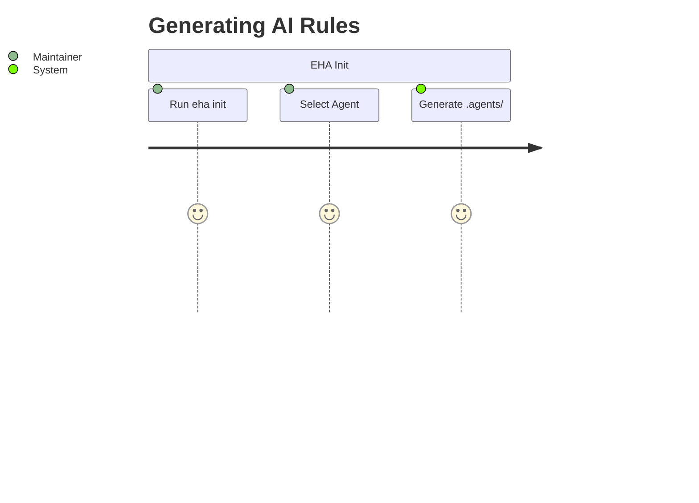
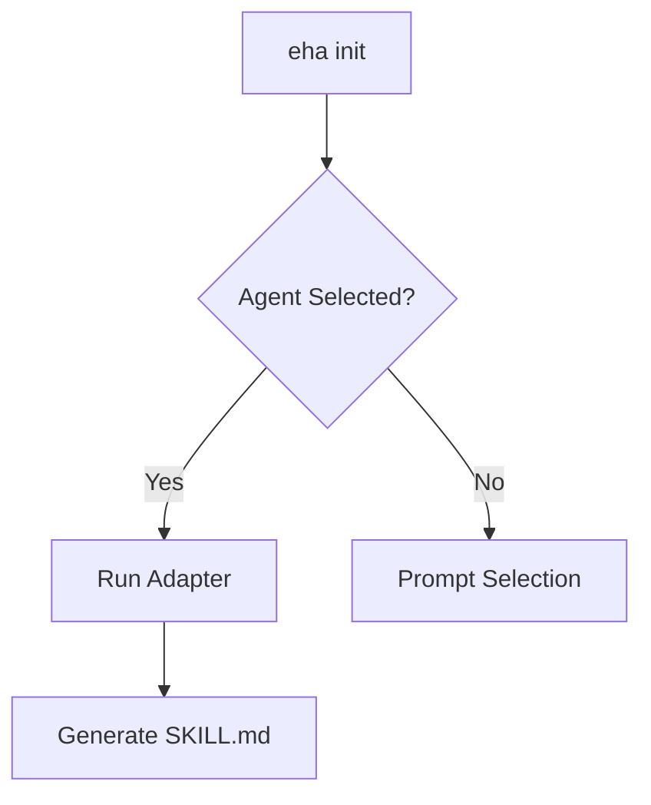

# Product Requirements Document (PRD)

Last update: 2026-05-30

Status: Live

---

## 1. Description
Eye Hate Agent (EHA) is a CLI meta-tool and agentic template engine. It initializes, manages, and structures repositories with standard SDD documentation and pre-configured instructions tailored to different AI coding agents (Antigravity, Copilot, Cursor).

## 2. Important
This is the central requirement document. Changes to EHA's CLI workflow or agent templates must align with this PRD.

## 3. Table of Contents
1. Vision Statement
2. Target Personas
3. Core Business Value
4. User Journeys & App Flow
5. Feature Workflows
6. Functional Requirements
7. Non-Functional Requirements
8. Acceptance Criteria

## 4. Scope
Defines requirements for the EHA engine, CLI arguments, and the `.agents/` template generation output.

## 5. Goals
Establish a universal repository structure that any AI agent can seamlessly hook into, ensuring agents adhere strictly to documented schemas rather than hallucinating paths.

## 6. Non Goals
We do not build custom agent models or runtime sandboxes. EHA only generates the instruction files that existing IDE agents consume.

## 7. Vision Statement
Make AI agents perfectly predictable and strictly aligned with the repository maintainer's intentions by forcing them to read standard instructions.

## 8. Target Personas
- **Solo Maintainer:** Generating templates quickly for new projects.
- **AI Agent:** Reading `.agents/` files to understand what it is allowed to do.

## 9. Core Business Value
Saves hours of prompt engineering per repository by centralizing agent instructions.

## 10. User Journeys & App Flow

## 11. Feature Workflows

## 12. Functional Requirements
- CLI must support `init`, `remove`, and auto-update prompts.
- Engine must dynamically load templates from `docs/templates/skills/`.
- Must generate `.agents/skills/[skill-name]/SKILL.md` structure.

## 13. Non-Functional Requirements
- Must execute in <2s.
- Must have no heavy external dependencies (keep `package.json` lean).

## 14. Acceptance Criteria
- Running `eha init antigravity` creates exactly 18 template files in `.agents/`.
- Running `eha remove` cleanly uninstalls everything.

## 15. External Dependencies & Partners
- Node.js environment.

## 16. Success Metrics
- 0% bug rate on `eha init` file generation.
- Templates perfectly align with agent parsers.

## 17. Related Documents
- [Architecture](architecture.md)
- [Testing](../technical/testing.md)

## 18. Open Questions
None.
