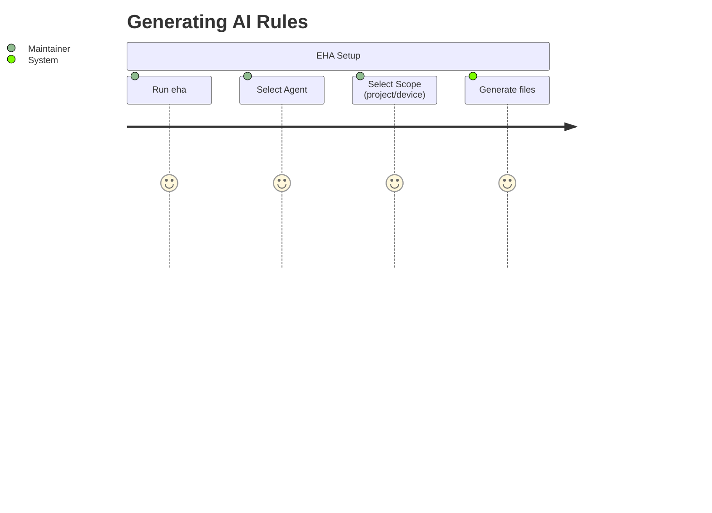
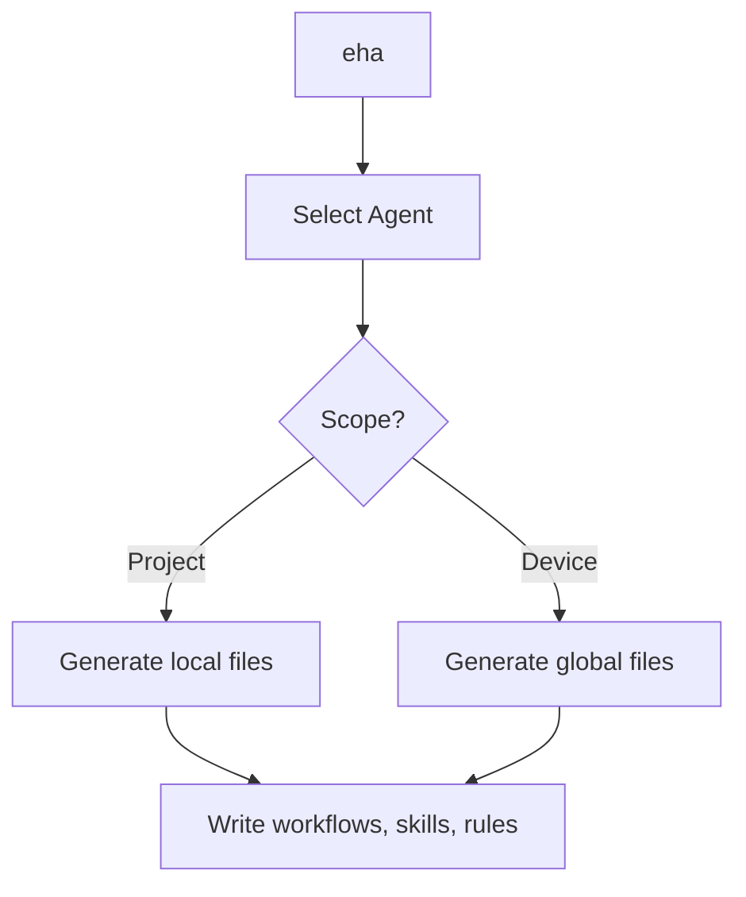

# Product Requirements Document (PRD)

Last update: 2026-05-30

Status: Live

---

## 1. Description
Eye Hate Agent (EHA) is a CLI meta-tool and agentic template engine. It initializes, manages, and structures repositories with standard SDD documentation and pre-configured instructions tailored to different AI coding agents (Antigravity, Copilot, Cursor, Claude).

## 2. Important
This is the central requirement document. Changes to EHA's CLI workflow or agent templates must align with this PRD. EHA is self-hosting; it uses its own architecture and templates to manage its codebase.

## 3. Table of Contents
- [1. Description](#1-description)
- [2. Important](#2-important)
- [3. Table of Contents](#3-table-of-contents)
- [4. Scope](#4-scope)
- [5. Goals](#5-goals)
- [6. Non Goals](#6-non-goals)
- [7. Vision Statement](#7-vision-statement)
- [8. Target Personas](#8-target-personas)
- [9. Core Business Value](#9-core-business-value)
- [10. User Journeys & App Flow](#10-user-journeys--app-flow)
- [11. Feature Workflows](#11-feature-workflows)
- [12. Functional Requirements](#12-functional-requirements)
- [13. Non-Functional Requirements](#13-non-functional-requirements)
- [14. Acceptance Criteria](#14-acceptance-criteria)
- [15. External Dependencies & Partners](#15-external-dependencies--partners)
- [16. Success Metrics](#16-success-metrics)
- [17. Related Documents](#17-related-documents)
- [18. Open Questions](#18-open-questions)

## 4. Scope
Defines requirements for the EHA engine, CLI arguments, and the template generation output (`.agents/`, `.claude/`, `.github/`).

## 5. Goals
Establish a universal repository structure that any AI agent can seamlessly hook into, ensuring agents adhere strictly to documented schemas rather than hallucinating paths.

## 6. Non Goals
We do not build custom agent models or runtime sandboxes. EHA only generates the instruction files that existing IDE agents consume.

## 7. Vision Statement
Make AI agents perfectly predictable and strictly aligned with the repository maintainer's intentions by forcing them to read standard instructions and standard file structures.

## 8. Target Personas
- **Solo Maintainer:** Generating templates quickly for new projects or managing the meta-tool itself.
- **AI Agent:** Reading platform-specific instruction surfaces (e.g., `.agents/`, `.claude/`, `.github/`) to understand what it is allowed to do.

## 9. Core Business Value
Saves hours of prompt engineering per repository by centralizing agent instructions. Ensures 100% adherence to Spec-Driven Development (SDD).

## 10. User Journeys & App Flow

## 11. Feature Workflows

## 12. Functional Requirements
- CLI must support `init`, `remove`, `doctor`, and auto-update prompts based on manifest staleness.
- Engine must dynamically load templates from `docs/templates/skills/` recursively.
- Engine must run specific formatting adapters (e.g., Antigravity, Claude, Copilot) when writing the output.
- Must generate workflows and skills into their respective target structures depending on the agent: `.agents/workflows/[name].md` & `.agents/skills/[name]/SKILL.md` (Antigravity), `.claude/commands/eha/[name].md` & `.claude/skills/[name]/SKILL.md` (Claude), and `.github/prompts/[name].prompt.md` & `.github/skills/[name]/SKILL.md` (Copilot).

## 13. Non-Functional Requirements
- Must execute quickly and dependably.
- Must have no heavy external dependencies (keep `package.json` lean, e.g., only `commander` and `chalk`).
- Must operate entirely statelessly relying on the bundled templates and `.eha/manifest.json`.

## 14. Acceptance Criteria
- Running `eha` for any agent (project scope) creates the correct number of workflow, skill, and rules files in their respective directories (e.g., `.agents/`, `.claude/`, `.github/`).
- Running `eha remove` cleanly uninstalls everything tracked by the manifest.
- Version mismatch triggers the auto-update prompt on next invocation.

## 15. External Dependencies & Partners
- Node.js environment (v18+).
- GitHub Actions with NPM Provenance via OIDC for automated publishing.

## 16. Success Metrics
- 0% bug rate on `eha init` file generation across supported IDEs.
- Generated instructions are flawlessly parsed and respected by Antigravity, Copilot, and Claude.

## 17. Related Documents
- [Architecture](architecture.md) - Details the pipeline and adapter pattern.
- [Testing](../development/testing.md) - E2E verification policy.

## 18. Open Questions
None.
