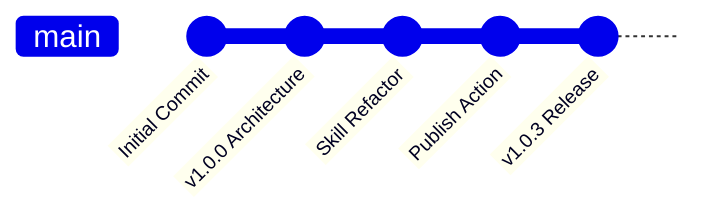

# Workflow

Last update: 2026-05-30

Status: Live

---

## 1. Description
This document outlines the engineering and collaboration workflows for modifying the Eye Hate Agent (EHA) meta-tool and templates.

## 2. Important
Always test `eha init` and `eha remove` in a dummy directory before committing template modifications.

## 3. Table of Contents
1. Local Development Loop
> 2. Branching Strategy
> 3. PR & Code Review Process
> 4. Issue Tracking & Triage

## 4. Scope
Covers the day-to-day workflow for the sole maintainer (Sulyadee) and AI Agents working in this repo.

## 5. Goals
Standardize how changes are proposed, tested, and shipped.

## 6. Non Goals
Does not cover architecture specifics (see `architecture.md`).

## 7. Local Development Loop
1. **Modify:** Edit `docs/templates/` or engine code (`src/engine/`).
> 2. **Register:** If adding a new skill/workflow, update `skill-registry.js` or `workflow-registry.js`.
> 3. **Test:** Run `eha init` in a dummy project via `npm link` (see `testing.md`).
> 4. **Commit:** Ensure `changelog.md` and `status.md` are updated.

## 8. Branching Strategy
EHA uses a Trunk-Based Development model since it is maintained by a single person. All changes are committed directly to `main`. 

## 9. PR & Code Review Process
N/A for a solo-maintainer project. Commits are direct. AI agents must ask for approval (Implementation Plan) before executing significant structural changes.

## 10. Issue Tracking & Triage
Handled natively via conversational context or GitHub Issues.

## 11. Success Metrics
Changes are shipped safely without breaking downstream agent file generation.

## 12. Related Documents
- [Testing](../technical/testing.md) - Instructions for the dummy directory test loop.

## 13. Open Questions
None.
