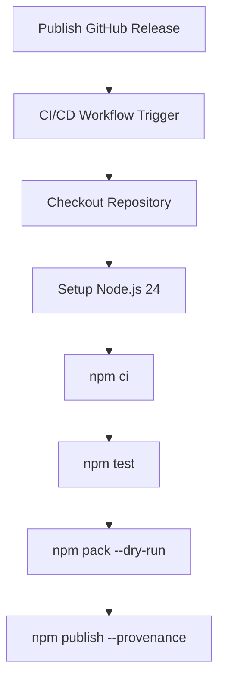

# CI/CD Configuration

Last update: 2026-06-01

Status: Live

---

## 1. Description
This document defines the automated continuous integration and continuous delivery (CI/CD) pipelines for Eye Hate Agent (EHA), which are driven by GitHub Actions.

## 2. Important
The NPM packaging and deployment lifecycle relies entirely on npm trusted publishing using OIDC. Standard releases are automated; never run `npm publish` manually on local terminals.

## 3. Table of Contents
- [1. Description](#1-description)
- [2. Important](#2-important)
- [3. Table of Contents](#3-table-of-contents)
- [4. Scope](#4-scope)
- [5. Goals](#5-goals)
- [6. Non Goals](#6-non-goals)
- [7. Pipeline Architecture](#7-pipeline-architecture)
- [8. Build Steps](#8-build-steps)
- [9. Testing & Quality Gates](#9-testing--quality-gates)
- [10. Deployment Environments](#10-deployment-environments)
- [11. Secrets & Environment Variables](#11-secrets--environment-variables)
- [12. Success Metrics](#12-success-metrics)
- [13. Related Documents](#13-related-documents)
- [14. Open Questions](#14-open-questions)

## 4. Scope
Covers automated workflows under `.github/workflows/` (specifically `publish.yml`), npm provenance, and trusted publishing configurations.

## 5. Goals
Ensure that every EHA release is programmatically validated, tested, packed, and signed securely prior to npm registry delivery.

## 6. Non Goals
Does not cover developer local workspace configurations or local testing command setups.

## 7. Pipeline Architecture
EHA's CD deployment is triggered by publishing a new GitHub release. The workflow steps are:
1. Triggered on GitHub Release publication or via manual dispatch (`workflow_dispatch`).
2. Runs on `ubuntu-latest`.
3. Clones the target codebase and checks out the release tag.
4. Sets up Node.js v24 environment with registry URL pointing to npmjs.org.
5. Installs clean, production-exact dependencies (`npm ci`).
6. Executes the test suite (`npm test`).
7. Conducts a packaging dry-run (`npm pack --dry-run`).
8. Securely publishes package with provenance (`npm publish --provenance --access public`) utilizing credentials mapped from process environment.

## 8. Build Steps
EHA is a vanilla JavaScript CLI program. It requires no compilation, minification, or transpile steps; source files are packed directly.

## 9. Testing & Quality Gates
- **Suite:** Node.js native test runner is executed (`npm test`).
- **Assertion:** 100% of core engine, templates exist, bidirectional registry synchronization, and CLI exit code integration tests must pass.

## 10. Deployment Environments
- **Production:** Public NPM Registry (`https://registry.npmjs.org`).

## 11. Secrets & Environment Variables
- `NODE_AUTH_TOKEN`: Mapped securely in process environment via GitHub secrets (`secrets.NPM_TOKEN`) to authenticate and publish the scoped NPM package.

## 12. Success Metrics
- Zero manual intervention required for NPM release deployments.
- Every release contains a verified, public NPM provenance badge.

## 13. Related Documents
- [Testing](../technical/testing.md) - Deeper local testing guides.
- [Maintaining](../../maintaining.md) - Standard operational procedures for new versions.

## 14. Open Questions
None.
