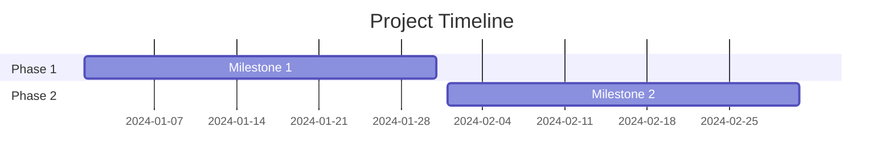

# Phases

Last update: YYYY-MM-DD

Status: [Proposed | Draft | Live | Deprecated | Archived]

---

## 1. Description
Briefly describe the purpose of this document and what it contains.

## 2. Important
Notes of important findings or critical constraints. Can be empty.

## 3. Table of Contents
[Generate a hyperlinked table of contents here containing ALL headings in this file (1 through N). Use standard markdown links, e.g., - [1. Description](#1-description)]

## 4. Scope
The boundaries of what this document covers.

## 5. Goals
What we aim to achieve with this specific document.

## 6. Non Goals
What is explicitly excluded from the scope of this document.

## 7. Overall Project Timeline
High-level estimate and major milestones. Visual timelines are preferred. Use mermaid.

## 8. Phase Registry
Links to individual markdown files in the `phases/` directory.

## 9. Sprint Tracker
### 9.1. Current Sprint (Date Range)
TBD

### 9.2. Active Tasks
TBD

### 9.3. Blockers
TBD

## 10. Success Metrics
How we measure if the goals of this document are achieved.

## 11. Related Documents
[Link to related document](path) - Short brief note about why it's related.

## 12. Open Questions
Any unresolved questions or assumptions. Can be empty.
