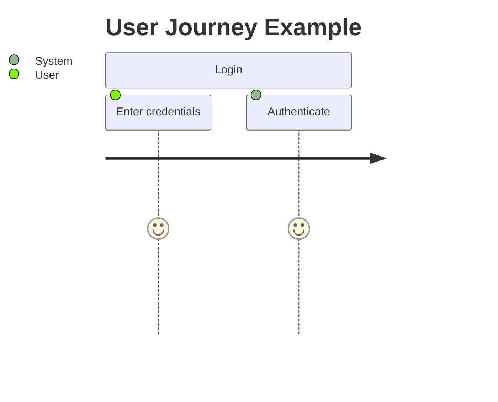

# Product Requirements Document (PRD)

Last update: YYYY-MM-DD

Status: [Proposed | Draft | Live | Deprecated | Archived]

---

## 1. Description
Summarize the product, system, or major epic requirement set at a high level.

## 2. Important
Notes of important findings or critical constraints. Can be empty.

## 3. Table of Contents
TOC goes here.

## 4. Scope
The boundaries of what this document covers.

## 5. Goals
What we aim to achieve with this specific document.

## 6. Non Goals
What is explicitly excluded from the scope of this document.

## 7. Vision Statement
A single, powerful sentence defining the ultimate end-state of the project.

## 8. Target Personas
Specific user types (e.g., Admin, Guest) to give the team empathy.

## 9. Core Business Value
The primary ROI, problem being solved, or operational improvement. Why does this project matter now?

## 10. User Journeys & App Flow
Flowcharts mapping the user's path through the app. Use mermaid.

## 11. Feature Workflows
Step-by-step logic flows for individual features. Use mermaid flowcharts to map complex feature logic.

## 12. Functional Requirements
Detailed list of functional capabilities.

## 13. Non-Functional Requirements
Reliability, performance, security, compliance, or UX expectations.

## 14. Acceptance Criteria
Specific criteria to verify the requirements are met.

## 15. External Dependencies & Partners
Third-party vendors and manual bottlenecks.

## 16. Success Metrics
How we measure if the goals of this document are achieved.

## 17. Related Documents
[Link to related document](path) - Short brief note about why it's related.

## 18. Open Questions
Any unresolved questions or assumptions. Can be empty.
