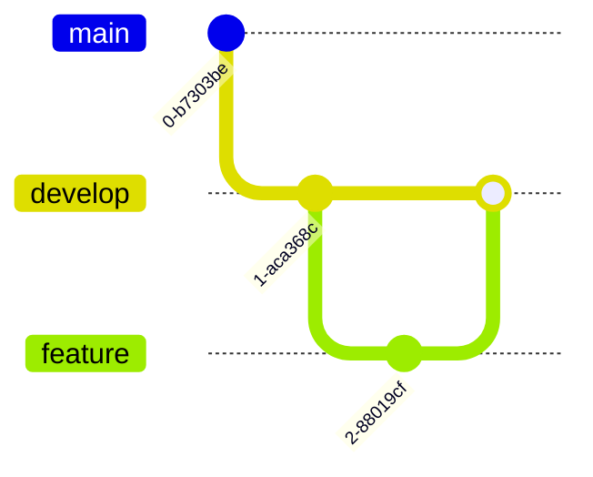

# Workflow

Last update: YYYY-MM-DD

Status: [Proposed | Draft | Live | Deprecated | Archived]

---

## 1. Description
Briefly describe the purpose of this document and what it contains.

## 2. Important
Notes of important findings or critical constraints. Can be empty.

## 3. Table of Contents
TOC goes here.

## 4. Scope
The boundaries of what this document covers.

## 5. Goals
What we aim to achieve with this specific document.

## 6. Non Goals
What is explicitly excluded from the scope of this document.

## 7. Local Development Loop
How to spin up and iterate.

## 8. Branching Strategy
GitFlow, Trunk-based, or custom rules. Diagram of branching logic is preferred. Use mermaid.

## 9. PR & Code Review Process
Required approvers, templates, and conventions.

## 10. Issue Tracking & Triage
How bugs and features are logged.

## 11. Success Metrics
How we measure if the goals of this document are achieved.

## 12. Related Documents
[Link to related document](path) - Short brief note about why it's related.

## 13. Open Questions
Any unresolved questions or assumptions. Can be empty.
