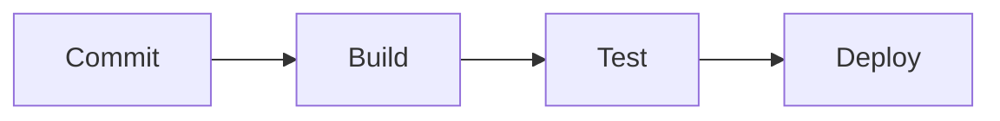

# CI/CD Configuration

Last update: YYYY-MM-DD

Status: [Proposed | Draft | Live | Deprecated | Archived]

---

## 1. Description
Briefly describe the purpose of this document and what it contains.

## 2. Important
Notes of important findings or critical constraints. Can be empty.

## 3. Table of Contents
[Generate a hyperlinked table of contents here containing ALL headings in this file (1 through N). Use standard markdown links, e.g., - [1. Description](#1-description)]

## 4. Scope
The boundaries of what this document covers.

## 5. Goals
What we aim to achieve with this specific document.

## 6. Non Goals
What is explicitly excluded from the scope of this document.

## 7. Pipeline Architecture
Overview of the branching and deployment flow. Flowcharts are preferred. Use mermaid.

## 8. Build Steps
Compilation, bundling, and artifact generation.

## 9. Testing & Quality Gates
Automated tests, linting, and security scans.

## 10. Deployment Environments
Staging, UAT, and Production definitions.

## 11. Secrets & Environment Variables
Required credentials (stored securely).

## 12. Success Metrics
How we measure if the goals of this document are achieved.

## 13. Related Documents
[Link to related document](path) - Short brief note about why it's related.

## 14. Open Questions
Any unresolved questions or assumptions. Can be empty.
