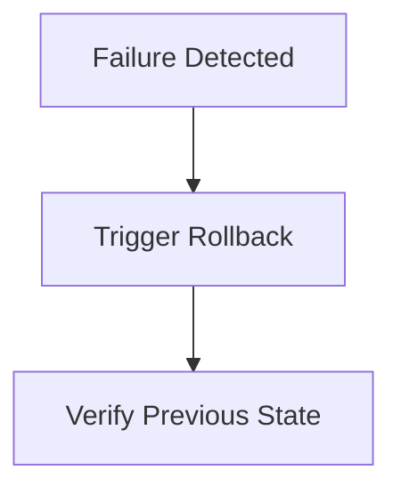

# Production Runbook

Last update: YYYY-MM-DD

Status: [Proposed | Draft | Live | Deprecated | Archived]

---

## 1. Description
Describe what this runbook covers and which environment or service it applies to.

## 2. Important
Notes of important findings or critical constraints. Can be empty.

## 3. Table of Contents
[Generate a hyperlinked table of contents here containing ALL headings in this file (1 through N). Use standard markdown links, e.g., - [1. Description](#1-description)]

## 4. Scope
The boundaries of what this document covers.

## 5. Goals
What we aim to achieve with this specific document.

## 6. Non Goals
What is explicitly excluded from the scope of this document.

## 7. Environment Overview
Production environment summary. Key dependencies or infrastructure notes.

## 8. Prerequisites and Access
- Required tools
- Required permissions or credentials
- Safety checks before making changes

## 9. Release / Deployment Procedure
1. Step 1
2. Step 2
3. Step 3

## 10. Verification / Smoke Checks
Checks to run to ensure deployment is healthy.

## 11. Rollback / Recovery
Steps to recover from a failed deployment. Flowcharts are preferred. Use mermaid.

## 12. Operational Notes
Known gotchas.

## 13. Success Metrics
How we measure if the goals of this document are achieved.

## 14. Related Documents
[Link to related document](path) - Short brief note about why it's related.

## 15. Open Questions
Any unresolved questions or assumptions. Can be empty.
