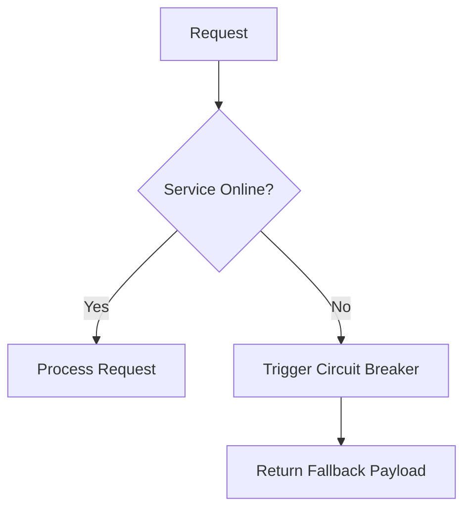

# Error Handling

Last update: YYYY-MM-DD

Status: [Proposed | Draft | Live | Deprecated | Archived]

---

## 1. Description
Briefly describe the purpose of this document and what it contains.

## 2. Important
Notes of important findings or critical constraints. Can be empty.

## 3. Table of Contents
[Generate a hyperlinked table of contents here containing ALL headings in this file (1 through N). Use standard markdown links, e.g., - [1. Description](#1-description)]

## 4. Scope
The boundaries of what this document covers.

## 5. Goals
What we aim to achieve with this specific document.

## 6. Non Goals
What is explicitly excluded from the scope of this document.

## 7. Standard Error Payload
The exact JSON shape returned on failure.

## 8. Global Error Codes
A registry of specific business logic errors.

## 9. Client-Side Handling Rules
How the frontend should display or retry failures.

## 10. Server-Side Fallbacks
Circuit breakers and degraded modes. Diagram of fallback flow is preferred. Use mermaid.

## 11. Success Metrics
How we measure if the goals of this document are achieved.

## 12. Related Documents
[Link to related document](path) - Short brief note about why it's related.

## 13. Open Questions
Any unresolved questions or assumptions. Can be empty.
