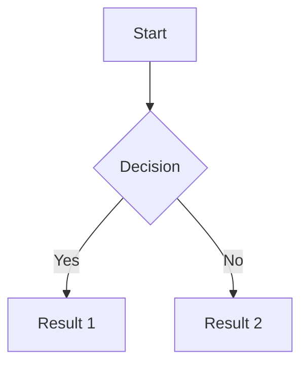
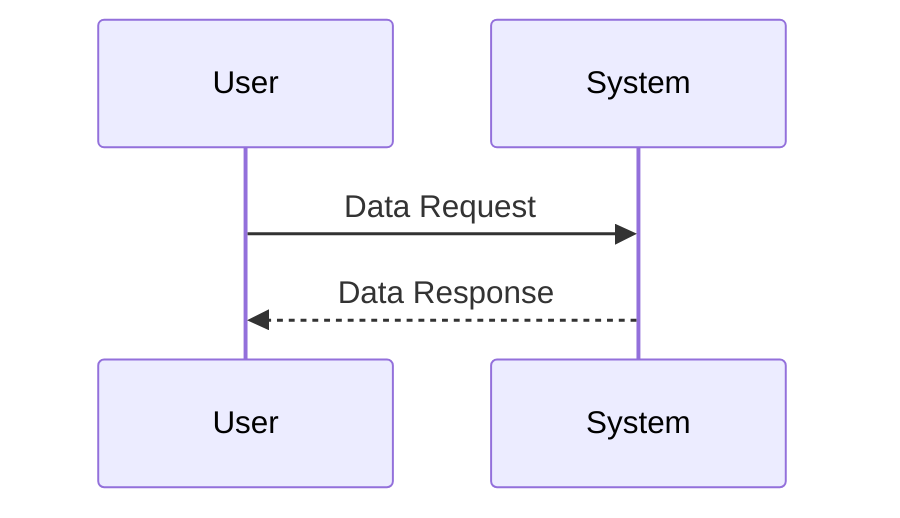

# Architecture

Last update: YYYY-MM-DD

Status: [Proposed | Draft | Live | Deprecated | Archived]

---

## 1. Description
> [!NOTE] Briefly describe the purpose of this document and what it contains.

## 2. Important
> [!NOTE] Notes of important findings or critical constraints. Can be empty.

## 3. Table of Contents
> [!NOTE] TOC goes here.

## 4. Scope
> [!NOTE] The boundaries of what this document covers.

## 5. Goals
> [!NOTE] What we aim to achieve with this specific document.

## 6. Non Goals
> [!NOTE] What is explicitly excluded from the scope of this document.

## 7. Tech Stack Overview
| Area | Choice | Notes |
| --- | --- | --- |
| Application or service | TBD | |
| Runtime or platform | TBD | |
| Storage | TBD | |
| External integrations | TBD | |

## 8. Architecture Pattern
> [!NOTE] Describe architecture design pattern, system topology, component boundaries, and foundational control flow.

## 9. System Flow
> [!NOTE] General overview of how the system work from start to end. Diagram or flowchart visual are preferred. Use mermaid.

## 10. Data Flow
> [!NOTE] General overview of inter-feature data flow, mapped against architectural patterns and system flow. Diagram or flowchart visual are preferred. Use mermaid.

## 11. Tools Integration
> [!NOTE] Such as hardware or software or external api and relevant tools. Can be empty.

| Integration | Purpose | Kind | Notes |
| --- | --- | --- | --- |
| TBD | TBD | TBD | *Software/Hardware/APIs/Other* |

## 12. Global Parameters and Constraints
> [!NOTE] Detail the system's global restrictions, such as performance requirements, caching policies, and error-handling mechanisms (e.g., "Supports offline execution for core features" or "Memory footprint restricted to 50MB").

## 13. Architecture Decision Records (ADRs)
> [!NOTE] A collection of ADRs documenting the rationale behind technical decision (e.g., "Choosing React over Vue for state management flexibility" or "Adopting Domain-Driven Design to leverage bounded contexts").

## 14. Success Metrics
> [!NOTE] How we measure if the goals of this document are achieved.

## 15. Related Documents
> [!NOTE] [Link to related document](path) - Short brief note about why it's related (e.g., [Guidelines](path) - technical implementation rules).

## 16. Open Questions
> [!NOTE] Unresolved architectural questions or assumptions. Can be empty.
