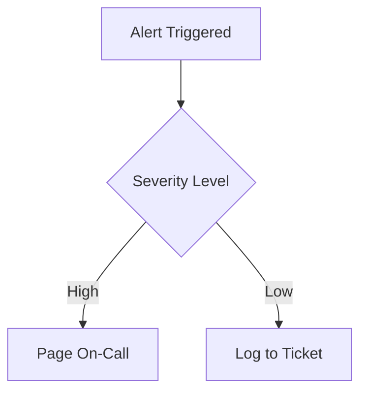

# Observability & Telemetry

Last update: YYYY-MM-DD

Status: [Proposed | Draft | Live | Deprecated | Archived]

---

## 1. Description
> [!NOTE] Briefly describe the purpose of this document and what it contains.

## 2. Important
> [!NOTE] Notes of important findings or critical constraints. Can be empty.

## 3. Table of Contents
> [!NOTE] TOC goes here.

## 4. Scope
> [!NOTE] The boundaries of what this document covers.

## 5. Goals
> [!NOTE] What we aim to achieve with this specific document.

## 6. Non Goals
> [!NOTE] What is explicitly excluded from the scope of this document.

## 7. Logging Strategy & Levels
> [!NOTE] Formatting (e.g., JSON) and severity rules (Info/Warn/Error).

## 8. Metrics & Dashboards
> [!NOTE] Key Performance Indicators (latency, error rates).

## 9. Distributed Tracing
> [!NOTE] Request IDs and flow mapping across microservices.

## 10. Alerting Rules & Thresholds
> [!NOTE] Conditions that trigger on-call pages. Flowcharts are preferred. Use mermaid.

## 11. Success Metrics
> [!NOTE] How we measure if the goals of this document are achieved.

## 12. Related Documents
> [!NOTE] [Link to related document](path) - Short brief note about why it's related.

## 13. Open Questions
> [!NOTE] Any unresolved questions or assumptions. Can be empty.
