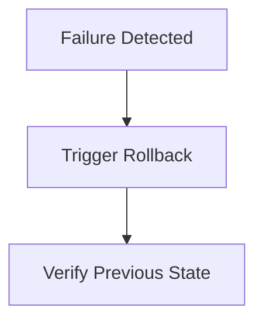

# Production Runbook

Last update: YYYY-MM-DD

Status: [Proposed | Draft | Live | Deprecated | Archived]

---

## 1. Description
> [!NOTE] Describe what this runbook covers and which environment or service it applies to.

## 2. Important
> [!NOTE] Notes of important findings or critical constraints. Can be empty.

## 3. Table of Contents
> [!NOTE] TOC goes here.

## 4. Scope
> [!NOTE] The boundaries of what this document covers.

## 5. Goals
> [!NOTE] What we aim to achieve with this specific document.

## 6. Non Goals
> [!NOTE] What is explicitly excluded from the scope of this document.

## 7. Environment Overview
> [!NOTE] Production environment summary. Key dependencies or infrastructure notes.

## 8. Prerequisites and Access
- Required tools
- Required permissions or credentials
- Safety checks before making changes

## 9. Release / Deployment Procedure
1. Step 1
2. Step 2
3. Step 3

## 10. Verification / Smoke Checks
> [!NOTE] Checks to run to ensure deployment is healthy.

## 11. Rollback / Recovery
> [!NOTE] Steps to recover from a failed deployment. Flowcharts are preferred. Use mermaid.

## 12. Operational Notes
> [!NOTE] Known gotchas.

## 13. Success Metrics
> [!NOTE] How we measure if the goals of this document are achieved.

## 14. Related Documents
> [!NOTE] [Link to related document](path) - Short brief note about why it's related.

## 15. Open Questions
> [!NOTE] Any unresolved questions or assumptions. Can be empty.
