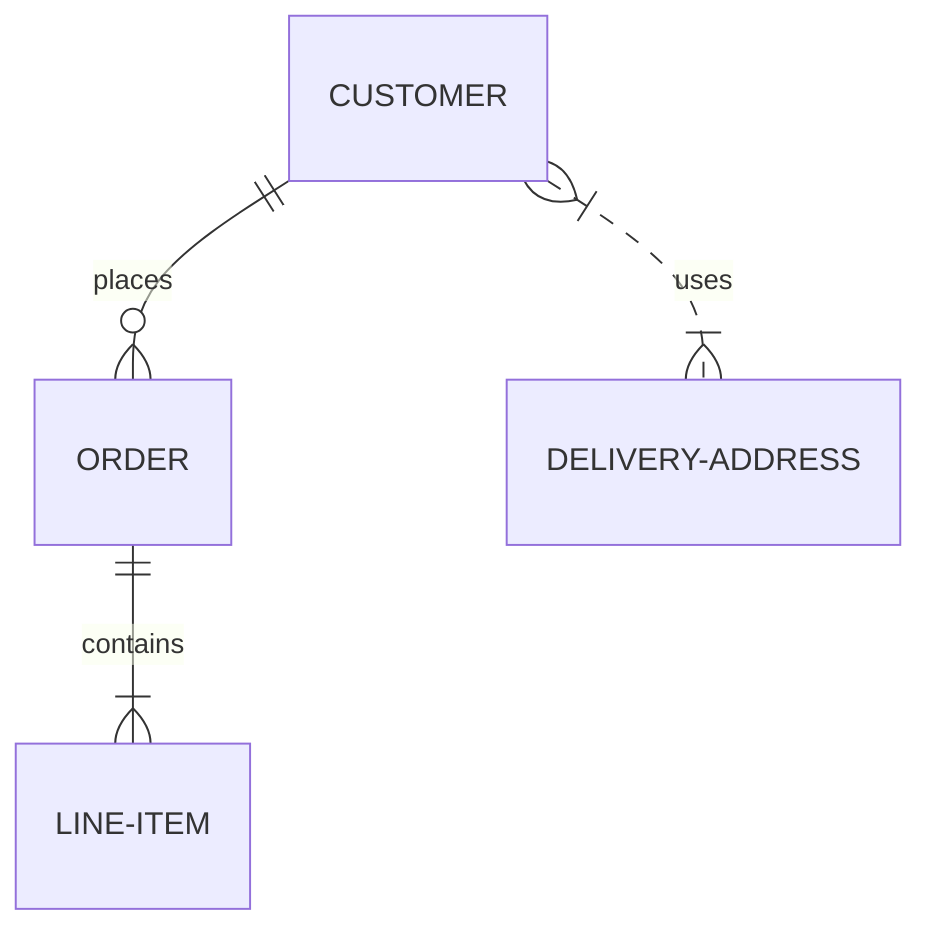

# Database Schema

Last update: YYYY-MM-DD

Status: [Proposed | Draft | Live | Deprecated | Archived]

---

## 1. Description
> [!NOTE] Briefly describe the purpose of this document and what it contains.

## 2. Important
> [!NOTE] Notes of important findings or critical constraints. Can be empty.

## 3. Table of Contents
> [!NOTE] TOC goes here.

## 4. Scope
> [!NOTE] The boundaries of what this document covers.

## 5. Goals
> [!NOTE] What we aim to achieve with this specific document.

## 6. Non Goals
> [!NOTE] What is explicitly excluded from the scope of this document.

## 7. Database Architecture
> [!NOTE] Type of DB (SQL/NoSQL) and clustering details.

## 8. Entity Relationship Diagram (ERD)
> [!NOTE] Visual or text-based map of table relationships. ERDs are preferred. Use mermaid.

## 9. Schema Definitions (Tables/Collections)
> [!NOTE] Specific columns, types, and constraints.

## 10. Indexes & Performance
> [!NOTE] Keys required for fast lookups.

## 11. Migration Strategy
> [!NOTE] How schema changes are versioned and deployed.

## 12. Data Dictionary
> [!NOTE] Single source of truth for business definitions. Define what key domain terms actually mean (e.g., "An *Active User* is someone who logged in within 30 days, excluding admins").

## 13. Success Metrics
> [!NOTE] How we measure if the goals of this document are achieved.

## 14. Related Documents
> [!NOTE] [Link to related document](path) - Short brief note about why it's related.

## 15. Open Questions
> [!NOTE] Any unresolved questions or assumptions. Can be empty.
