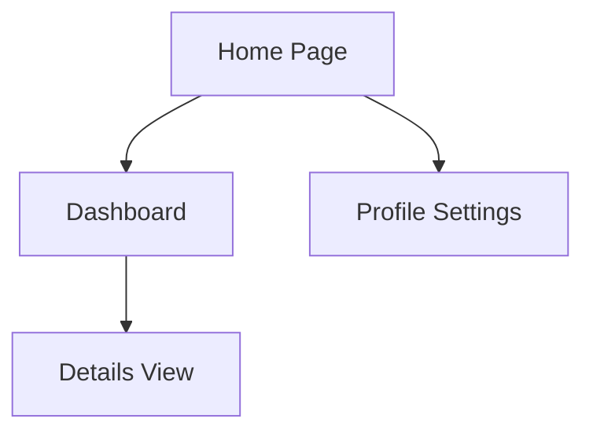

# UI/UX

Last update: YYYY-MM-DD

Status: [Proposed | Draft | Live | Deprecated | Archived]

---

## 1. Description
> [!NOTE] Briefly describe the purpose of this document and what it contains.

## 2. Important
> [!NOTE] Notes of important findings or critical constraints. Can be empty.

## 3. Table of Contents
> [!NOTE] TOC goes here.

## 4. Scope
> [!NOTE] The boundaries of what this document covers.

## 5. Goals
> [!NOTE] What we aim to achieve with this specific document.

## 6. Non Goals
> [!NOTE] What is explicitly excluded from the scope of this document.

## 7. Design Philosophy
> [!NOTE] The core principles guiding the user experience.

## 8. Design System & Theme
> [!NOTE] Colors, typography, and visual guidelines.

## 9. Wireframing & Prototyping
> [!NOTE] Links to external tools (Figma, Adobe) or raw UI specs generated by humans/AI in the repo.

## 10. Screen Layouts
> [!NOTE] Core page structures and navigation flows. Wireframes are preferred. Use mermaid.

## 11. Component Library
> [!NOTE] Reusable UI elements (buttons, modals).

## 12. Responsive Breakpoints
> [!NOTE] Behavior across mobile, tablet, and desktop.

## 13. Accessibility (a11y) Requirements
> [!NOTE] Contrast ratios, ARIA labels.

## 14. Implementation Backlog
> [!NOTE] List of UI tasks (e.g., `Task-ID: Description`).

## 15. Design Handoff Approaches
> [!NOTE] How designs are explicitly transferred to developers.

## 16. Success Metrics
> [!NOTE] How we measure if the goals of this document are achieved.

## 17. Related Documents
> [!NOTE] [Link to related document](path) - Short brief note about why it's related.

## 18. Open Questions
> [!NOTE] Any unresolved questions or assumptions. Can be empty.
